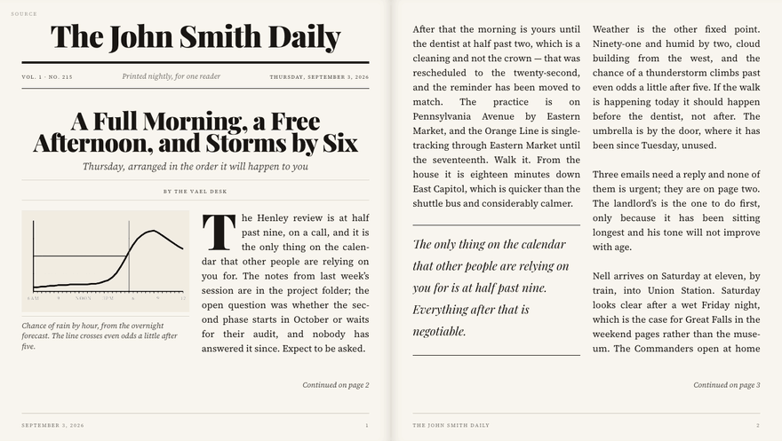
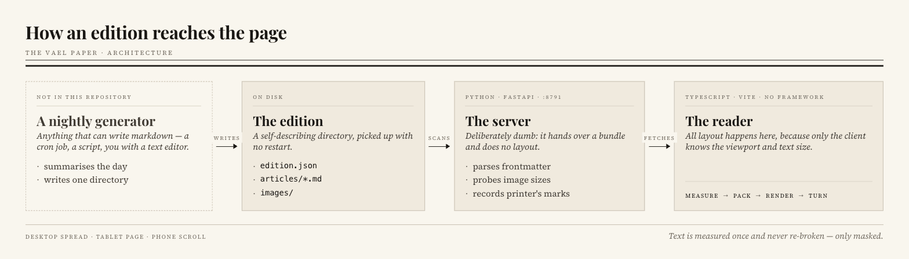

# The Vael Paper 📰

Your own daily newspaper, no bias, no ads: written overnight from your
calendar, budget, feeds and notes, and printed like a real broadsheet.

> **Want the whole thing?** This repo is the press: it prints an edition, it
> never writes one. **[hermes-paper-agent](https://github.com/vaelkeep/hermes-paper-agent)** is the complete nightly
> newspaper — the desks that write it, the agent that runs them, and this
> engine to print it. Start there unless you only need the press.

*The Vael Paper* is the press. The paper it prints is yours, under your own
name: the demo below is one reader's, *The John Smith Daily*, and the
masthead comes from a single line in `paper.json`.

**[▶ Try it now](https://vaelkeep.github.io/vael-paper/)** — the demo
edition, live. Turn pages with the arrow keys, resize the window, change the
text size, and press **Source** in the corner to see the markdown behind any
page.




*The opening spread of the demo edition, at the default text size. Nothing
here is a mockup: the column count is chosen from the measure, the drop caps are
sized from the font's own cap-height, and both stories break to "continued on"
slugs that resolve to real page numbers. Resize the window and it repaginates
around wherever you were reading.*


[](https://github.com/vaelkeep/vael-paper/actions/workflows/ci.yml)

[](LICENSE)

## ✨ Highlights

- **Real pagination, not scrolling.** Text flows into fixed pages that are
  recomputed for your screen and text size — with orphan and widow control,
  "continued on page 4" slugs, and tables that break between rows.
- **Typography that holds up.** Self-hosted Source Serif 4 and Playfair Display
  on a strict baseline grid, justified and hyphenated, with drop caps solved
  from the font's real metrics.
- **Never loses your place.** Rotate the iPad or change the text size and you
  stay on the same sentence, because the reader addresses articles rather than
  page numbers.
- **Fits phone, tablet and desktop.** The same edition becomes a two-page
  spread on a desktop, a single page on a tablet, and a continuous scroll on a
  phone — the layout is recomputed for the screen it lands on, not squeezed
  into breakpoints.
- **Easy on the eyes.** Warm off-white ground, sepia and night grounds, six text
  sizes, and photographs printed as ink rather than pasted on.
- **Nothing to break at 4am.** A malformed article or a missing image becomes a
  visible "printer's mark", never a blank page.

## 📑 Contents

- [Overview](#-overview)
- [Getting started](#-getting-started)
- [Usage](#-usage)
- [Publishing an edition](#-publishing-an-edition)
- [Need an agent?](#-need-an-agent)
- [Configuration](#-configuration)
- [Architecture](#-architecture)
- [Security](#-security)
- [Development](#-development)
- [Roadmap](#-roadmap)
- [License](#-license)
- [Acknowledgements](#-acknowledgements)
- [Author](#-author)

## 📖 Overview

Most personal news tools give you a feed. A feed is endless, and it never tells
you that you have finished. A newspaper does: it has a front page, an order, an
end, and it is the same for the whole day.

The Vael Paper is that, for one reader. A process generates an edition overnight
— summarising the news, your calendar, whatever you like — and in the morning
you read a finished object with pages you turn.

**This project renders and serves an edition. It deliberately does not generate
one.** Something else writes a finished edition into `editions/` in the format
described in [`docs/FORMAT.md`](docs/FORMAT.md), and the reader prints it. That
separation means the reader can be built and tuned against a hand-written sample
edition, and anything that can write markdown — a cron job, a shell script, you
with a text editor — can publish an issue. If you would rather not write that
something yourself, [hermes-paper-agent](https://github.com/vaelkeep/hermes-paper-agent) is one, built to feed this —
see [Need an agent?](#-need-an-agent).

## 🚀 Getting started

### Prerequisites

- **Python 3.11+** and [uv](https://docs.astral.sh/uv/)
- **Node 20+** and npm
- macOS or Linux (developed on macOS; nothing is platform-specific except the
  optional launchd job)

### Install and run

```bash
git clone https://github.com/vaelkeep/vael-paper.git
cd vael-paper

npm --prefix reader install
npm --prefix reader run build

cd server && uv run vael-paper
```

Open **http://localhost:8791** and you are reading the demo edition.

### Run it every day

On macOS, run it as a launchd agent. The plist is a template — launchd needs
absolute paths and will not expand `~` — so substitute them as you install it:

```bash
mkdir -p data/logs
sed -e "s|__VAEL_PAPER__|$PWD|g" -e "s|__UV__|$(command -v uv)|g" \
    launchd/com.coreautomation.vaelpaper.plist \
    > ~/Library/LaunchAgents/com.coreautomation.vaelpaper.plist

launchctl load ~/Library/LaunchAgents/com.coreautomation.vaelpaper.plist
```

The server binds `0.0.0.0`, so it is reachable from a tablet on the same
network, or over a private network such as Tailscale.

### Publish it as a static site

Every response the server produces is a pure function of the files on disk, so
the whole paper can be exported and served with no Python running anywhere:

```bash
npm --prefix reader run build
cd server && uv run vael-paper-export --out ../site
```

`site/` is a complete static site — the reader, the API pre-rendered as JSON,
and the images — that works at a domain root or under a subpath. The
[`Pages` workflow](.github/workflows/pages.yml) does exactly this on every push
to `main` and is what serves the **Try it now** link above.

## 💡 Usage

| | |
|---|---|
| Turn a page | swipe, `←` / `→`, space, or `Home` / `End` |
| Text size | the `A`/`A` pair in the toolbar |
| Ground | Day / Sepia / Night |
| Jump to a story | **Contents** — sections and stories, with live page numbers |
| See the markdown | **Source** (top left, or `S`) — the files behind the page you are on, syntax-highlighted |
| Earlier issues | **Archive** |
| Paged ↔ scrolling | the mode button, which overrides the automatic choice |
| Broadsheet ↔ magazine | the layout button: columns chosen by measure, or one column across the page |
| Full screen | `⛶`, or press `f` |

On an iPad, **Add to Home Screen** runs it full-screen with no browser chrome.

### On every screen

There is one edition and no separate mobile version. The reader measures the
screen it is on and lays the same content out to suit it — the number of pages
shown, the number of columns, and whether it pages at all are all decided at
read time.

| Screen | Reads as | Columns | Line length |
|---|---|---|---|
| Phone, portrait | continuous scroll | 1 | ~41 characters |
| Tablet, portrait | a single page | 2 | ~43 characters |
| Tablet, landscape | a two-page spread | 1 per page | ~56–62 characters |
| Laptop / desktop | a two-page spread | 2 per page | ~39–43 characters |
| Ultrawide, full screen | a two-page spread | 3 per page | ~64 characters |

Phones scroll rather than page because at that width a "page" holds about
sixteen lines, which turns a short article into a dozen flips. That is a
default, not a rule — the mode button overrides it in either direction.

Rotating a tablet or changing the text size re-lays the whole edition and puts
you back on the sentence you were reading.

The column count above is the broadsheet layout. Press **Magazine** and every
page is set in a single column, so plates and tables take the whole column and
a story reads straight down rather than across. The column is held to a
readable measure of about 64 characters by widening the side margins, which is
what gives a magazine page its generous margins; turn the text up and they
close. The choice is remembered per device.

Links are canonical on the article, so they survive a change of device:

```
http://localhost:8791/#/2026-09-02/a/04-orbital-debris   ← stable
http://localhost:8791/#/2026-09-02/s/markets             ← jump to a section
http://localhost:8791/#/2026-09-02/p4                    ← resolved, then rewritten
```

> **Both bundled editions are fiction.** `editions/2026-09-03/` is the demo:
> *The John Smith Daily*, one invented reader's paper for one Thursday in
> Washington — the day's appointments, a budget and portfolio, the Commanders
> and the Nationals, showtimes, dinner specials, and a cat. The people, venues,
> films, figures and sources are made up, and every link points at an
> `.example` domain. `editions/2026-09-02/` is the engineering fixture: long
> articles that force continuations, a table that must break across columns, a
> deliberately malformed file. None of it is reporting.

## ⏱️ Make your own in five minutes

```bash
git clone https://github.com/vaelkeep/vael-paper && cd vael-paper
npm --prefix reader install && npm --prefix reader run build
cd server && uv sync && uv run vael-paper --port 8791
```

Open http://localhost:8791 — that is the demo edition. Now make it yours:

1. Edit `editions/paper.json`: your masthead, your motto, today's date as
   `founded`, and the sections you want in the order you want them.
2. Make a folder for tomorrow, `editions/2026-09-05/articles/`, and put one
   file in it:

   ```markdown
   # The First Edition

   *Written by hand, printed by the paper*

   Everything from here on is the body. Tomorrow a script writes this file.
   ```

3. Reload. The paper picks the folder up on the next request. Press
   **Source** in the corner to see the file behind the page.
4. Run `uv run vael-paper-check` from `server/` to see what a generator would
   be told to fix, then read [`docs/GENERATING.md`](docs/GENERATING.md) for
   how to have a model write it every night.

## 📰 Publishing an edition

Write a folder of markdown. The server picks it up on the next request — no
restart, no watcher, no manifest to keep in step.

```
editions/
├── paper.json            # masthead, motto, founding date, section order — written once
└── 2026-09-04/
    ├── articles/
    │   └── 01-markets.md # markdown, with or without frontmatter
    └── images/
        └── chart.png
```

```markdown
---
headline: Markets Slip as Traders Weigh the Rate Path
deck: A cautious session ends lower
section: markets
image: images/chart.png
sources:
  - name: Reuters
    url: https://www.reuters.com/markets/
---

The body starts here, in plain markdown. Pull quotes, lists, tables and
figures all become newspaper furniture.
```

The format is built for a model writing unattended. A leading `# Heading` is
a headline if there is no frontmatter; a colon in a title is not an error;
`title`, `author`, `photo` and the other names a model reaches for are
accepted. Image dimensions, word counts, issue numbers and whether a picture
is a photograph or a chart are all worked out by the server — a generator is
never asked for something it cannot reliably know.

Then check it the way the server will read it:

```
$ vael-paper-check editions/2026-09-04
2026-09-04  The John Smith Daily  No. 216  15 articles, 2 images, 11 sections  (paper.json)
  marks (0)
  lint (1)
    07-ledger.md:18   table_wide   Table needs about 58 characters across and a column fits about 52; drop a column or shorten the longest cells.
```

Marks are things that are wrong, lint is things that will print badly, both
come with a file and line, and `--json` returns the report as data so a
generator can fix its own work in a second pass. The same report is served at
`/api/editions/<date>/check`. **Full specification:
[`docs/FORMAT.md`](docs/FORMAT.md).**

### Having a model write it

- [`docs/WRITING.md`](docs/WRITING.md) — the author's guide, written to be
  handed to a model as instructions: fields, lengths, tables, pictures, voice.
- [`docs/GENERATING.md`](docs/GENERATING.md) — how to assemble a paper every
  night with a modest local model: desks, the write → check → fix loop, what
  to feed it, what to keep out of its hands.
- [`skills/`](skills/) — `write-edition` and `check-edition`, for a coding
  agent that takes a `SKILL.md`.

A story that carries `chart: {kind: bars, values: [...]}` instead of an image
gets its plate drawn by the server in the paper's style — a model writes the
numbers, the paper draws the picture.

## 🤖 Need an agent?

This project is the press, not the newsroom — it prints an edition, it never
writes one. If you want the other half, there is a working generator built to
feed it:

**[hermes-paper-agent](https://github.com/vaelkeep/hermes-paper-agent)** — a nightly newspaper generator that runs as
an agent. **[▶ Read an edition it produced](https://vaelkeep.github.io/hermes-paper-agent/)**, published the same way
this demo is.

It is the shape [`docs/GENERATING.md`](docs/GENERATING.md) describes, built
out and running:

- **Data desks** — small Python scripts that turn a calendar, a ledger, a step
  count and live weather and market feeds into correct tables and `chart:`
  blocks. Code, never a model, so the numbers are right every night.
- **Prose desks** — a model writing one story at a time from a handful of
  already-summarised items, which is what lets a modest local model succeed.
- **A lead desk** that runs last, sees everything the others filed, and writes
  the front page.
- **The write → check → fix loop** around `vael-paper-check`, gated on
  `"ok": true` so a red edition never publishes.

It runs on [Hermes](https://hermes-agent.nousresearch.com), though little of it
is Hermes-specific — its `AGENTS.md` and `SKILL.md` are the portable
conventions, and its README has a section on moving it to another agent.

Anything else that writes markdown into `editions/` works just as well. That is
the point of the separation, and the reason this repo has no opinion about what
generated the folder it is reading.

## ⚙️ Configuration

| Variable | Description | Default |
|---|---|---|
| `VAEL_PAPER_PORT` | Port for the API and reader | `8791` |
| `VAEL_PAPER_HOST` | Bind address | `0.0.0.0` |
| `VAEL_PAPER_EDITIONS` | Directory of editions | `./editions` |
| `VAEL_PAPER_READER` | Built reader bundle | `./reader/dist` |

The defaults sit clear of the ports commonly taken on a development machine —
`80`, `443`, `3000`, `5173`, `8000`, `8080` — so it can usually be started
without moving anything else. It uses **`8791`** for the API and **`5174`** for
its own dev server; set `VAEL_PAPER_PORT` if either clashes.

## 🏗️ Architecture



```
vael-paper/
├── server/          FastAPI: scans editions, parses frontmatter, probes images
├── reader/          Vite + vanilla TypeScript reader
│   └── src/
│       ├── layout/  the pagination engine — measure, pack, plan
│       ├── render/  slice-and-clip rendering, page turns
│       ├── content/ markdown parser and edition validation
│       └── styles/  the broadsheet type system
├── editions/        editions on disk; a sample one is committed
├── docs/            format specification and engineering notes
└── launchd/         macOS agent definition
```

The server is deliberately dumb — it hands the client a bundle and does no
layout, because pagination depends on a viewport and font size only the client
knows. Everything interesting happens in `reader/src/layout/`, and is written up
in **[`docs/PAGINATION.md`](docs/PAGINATION.md)**.

The short version: each article is measured *once* into an offscreen ribbon, a
pure function packs columns using integer arithmetic over baselines, and a
fragment is rendered by cloning whole blocks and clipping them. Text is never
re-broken, only masked — which is why justification, hyphenation and drop caps
survive a page break intact.

## 🔒 Security

Article bodies are written by a language model from feeds nobody controls, so
untrusted input is the normal case rather than the exception:

- **Links are validated.** Only `http` and `https` URLs are ever linked;
  `javascript:`, `data:` and schemes smuggled past with control characters are
  refused, and the link degrades to plain text.
- **Content is escaped before any markup is generated,** and the markdown
  grammar accepts no raw HTML.
- **The server binds a local interface** and has no authentication. Put it on a
  private network or a tailnet — do not expose it to the internet.

## 🛠 Development

```bash
# reader — pagination engine, markdown parser, typography
cd reader
npm run dev        # :5174 with hot reload, proxying the API
npm test           # packer, geometry, markdown parser, drop-cap solver
npm run typecheck

# server — scanner and API
cd server
uv run vael-paper  # :8791
uv run pytest      # frontmatter tolerance, URL safety, the four endpoints
```

Both suites are pure and fast — no browser, no network, under two seconds
together. [CI](.github/workflows/ci.yml) runs them on every push, plus a job
that re-scans both bundled editions: the fixture must keep producing exactly
its one deliberate warning, and the demo must produce none, because it is the
worked example in the format guide — if it stops scanning, the documentation
is wrong even when the code is right.

The engine's rules are not obvious from the code alone. **Read
[`docs/PAGINATION.md`](docs/PAGINATION.md) before changing anything under
`reader/src/layout/`** — it documents six invariants that, if broken, produce
symptoms that look like something else entirely.

## 🔮 Roadmap

- [x] A nightly generator — shipped as a companion project, [hermes-paper-agent](https://github.com/vaelkeep/hermes-paper-agent)
- [ ] Front-page template matcher — named areas, a rail, teasers
- [ ] Package the four API endpoints as a plugin for a wider agent host
- [ ] Offline caching via a service worker
- [ ] Repeated column headers on a continued table

## 📜 License

[MIT](LICENSE) — do what you like with it, keep the copyright notice.

© 2026 vaelkeep

The MIT licence covers this project's own code. The fonts bundled under
`reader/src/fonts/` are third-party works redistributed under the SIL Open Font
License 1.1, which permits it — see [`NOTICE`](NOTICE).

## 🙏 Acknowledgements

- [Source Serif 4](https://github.com/adobe-fonts/source-serif) by Adobe and
  [Playfair Display](https://github.com/clauseggers/Playfair-Display) by Claus
  Eggers Sørensen — both SIL OFL 1.1
- [FastAPI](https://fastapi.tiangolo.com/), [uv](https://docs.astral.sh/uv/),
  [Vite](https://vite.dev/) and [Vitest](https://vitest.dev/)
- The pagination approach owes its shape to the failure modes of
  [paged.js](https://pagedjs.org/), which splits the DOM where this splits a
  ledger

## 👤 Author

**vaelkeep** — [@vaelkeep](https://github.com/vaelkeep)

Project: [github.com/vaelkeep/vael-paper](https://github.com/vaelkeep/vael-paper)
