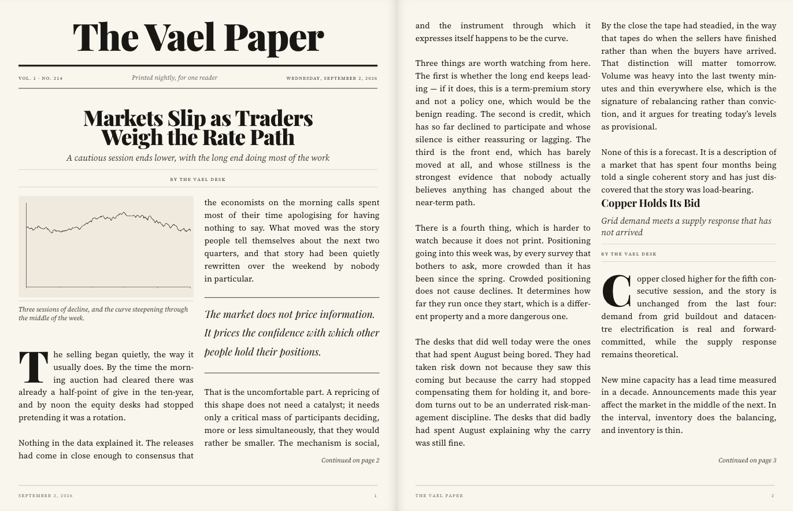

# The Vael Paper

A personal daily newspaper: real page turns, real typography, real pagination.



*The opening spread of the sample edition, at the default text size. Everything
here is laid out at read time: the columns are chosen from the measure, the
drop caps are sized from the font's own cap-height, and both stories break to
"continued on" slugs that resolve to real page numbers. Resize the window and
it all repaginates around wherever you were reading.*

This project **renders and serves** an edition. It does not gather content.
Something else — most likely a nightly Vaelkeep cron job — writes a finished
edition into `editions/` in the format described in [`docs/FORMAT.md`](docs/FORMAT.md),
and the reader prints it. That separation means the reader can be developed
against a hand-written sample edition, and anything that can write markdown can
publish an issue.

```
                nightly generator (out of scope)
                        │ writes
                        ▼
        editions/YYYY-MM-DD/{edition.json, articles/, images/}
                        │ scanned
                        ▼
        server/  FastAPI on :8791  — scan, parse, probe images
                        │ fetch
                        ▼
        reader/  Vite + vanilla TS — measure → pack → render → turn
```

## Running it

```sh
# API + the built reader, on :8791
cd server && uv run vael-paper

# or, for development: API on :8791 and the reader on :5174 with HMR
cd server && uv run vael-paper &
cd reader && npm run dev
```

`npm run build` produces `reader/dist`, which the server picks up automatically
and serves from the same origin. `launchd/com.coreautomation.vaelpaper.plist`
runs the server as an agent; it is modelled on the existing Vaelkeep server job.

Reachable over Tailscale on either port. Ports were chosen to avoid Vaelkeep
(`8787`), Ollama (`11434`), Obsidian's REST plugin (`27124`), Docker Desktop
(`80/443/3001/8000/9000`) and the Vite server already on `5173`.

## Reading it

| | |
|---|---|
| Turn a page | swipe, `←` / `→`, space, or `Home` / `End` |
| Text size | the `A`/`A` pair in the toolbar |
| Ground | Day / Sepia / Night |
| Jump | Contents — sections and stories, with live page numbers |
| Earlier issues | Archive |
| Paged ↔ scrolling | the mode button, which overrides the breakpoint either way |

Deep links are canonical on the **article**, not the page:
`#/2026-09-02/a/04-orbital-debris`. A page route like `#/2026-09-02/p4` is
accepted, resolved under the current pagination, and rewritten — because a page
number is only true for the viewport and font size that produced it.

## How the pagination works

The interesting part, and the thing most likely to be broken by a well-meaning
edit. Three stages, described fully in `src/layout/`.

**Measure once.** Each article is laid out a single time, offscreen, at exactly
the base column width, and read back into a `LineLedger` — how many baselines
each block occupies. One forced layout for the whole edition.

**Pack arithmetically.** `packColumn` fills a column from a ledger using integer
arithmetic over baselines. It is a pure function: no DOM, no measurement. Orphans,
widows, keep-with-next, atomic figures and the jump-slug reservation are all
integer constraints. It is unit-tested against synthetic ledgers.

**Render by slice-and-clip.** A fragment is the *whole* blocks it spans, cloned
from the article's template, inside a window of the exact allotted height, with
the ribbon shifted up by `fromLine × lineHeight`. Text is never re-broken — only
masked.

That last point is the whole design. The rendered fragment is the same DOM at the
same width that was measured, so measured layout and rendered layout are identical
by construction. Justification, hyphenation and drop-cap indents survive a column
break because the paragraph was never split — which is exactly the failure class
that makes DOM-splitting paginators unreliable.

Two consequences worth knowing:

- **The ledger's cache key excludes page height.** Line breaking depends only on
  the measure, so a height-only change — an iPad toolbar collapsing, a window
  dragged shorter — reuses every ledger and costs a repack of a few milliseconds
  rather than a remeasure.
- **Page numbers are not identity.** They are a function of the layout key, which
  is why the router addresses articles.

### Invariants you must not break

1. **The baseline grid.** `--lh` is an integer pixel value and every block margin
   and atomic height is a multiple of it. Introduce a fractional baseline and the
   packer's integer arithmetic stops matching what the browser draws.
2. **Atomic blocks are snapped after measurement.** Splittable text is
   baseline-aligned for free, because its line-height *is* the baseline. Pull
   quotes, figures with captions and rules are not — they set their own leading
   or carry borders — so `measure.ts` writes their measured height back onto
   the template. Skip that and a block half a baseline taller than the ledger
   believes shows up as a line sliced through the middle at a column foot.
3. **The rhythm rule.** Vertical space in a ribbon is expressed *only* as
   `margin-block-start` via `.ribbon > * + *`. Never `margin-block-end`, never a
   bare margin on a child. `BlockMetrics.leadLines` assumes exactly this; break it
   and slices drift by one lead per column, which presents as a phantom off-by-one
   in the packer.
4. **One child per block.** A ribbon's children map one-to-one onto
   `article.blocks`, so a cursor's `blockIndex` means the same thing in the parser,
   the ledger, the packer and the renderer. Head furniture is built separately for
   this reason — and it is what lets the front-page lead take a full-width headline
   while its body flows in base columns.
5. **Phase discipline.** Write, then one forced flush, then read, then compute.
   `util/rw-batch.ts` logs violations in development.

## Development checks

```sh
cd reader && npm test        # packer, geometry and markdown — all pure
cd reader && npm run typecheck
```

In development the reader also:

- logs each pagination with its cost, page count and mode;
- asserts that no rendered column overflows its box, and that every slice and
  atomic block is a whole number of baselines — both catch the packer and the
  renderer disagreeing, which is the one bug this design exists to prevent;
- exposes `window.__vael` for inspecting the plan, the current anchor and the
  layout key, and for driving `setScale()` directly.

Current cost on this machine for the 8-article sample: **~20ms cold, ~10ms warm.**

## The column rule

Column count is chosen by **measure**, not by breakpoints: the paper picks the
count whose resulting line length lands closest to an ideal ~62 characters,
inside a readable band of 34–75. Deliberately *not* "as many columns as fit" —
that is what gives a printed broadsheet its cramped five-column grid, which
reads badly on a screen — and deliberately not a fixed number, which would give
a 97-character line on an ultrawide display.

The consequence is that the paper always fills the display, and a very wide
window answers by growing **columns** rather than line length. Because the rule
is expressed in characters, it also scales with the text-size setting for free:
turn the type up far enough and a column drops away on its own.

| | mode | columns per leaf | measure | screen used |
|---|---|---|---|---|
| Ultrawide 3440, full screen | spread | 3 | ~64 chars | 100% |
| Desktop 1630 windowed | spread | 2 | ~43 chars | 100% |
| MacBook 1512×900 | spread | 2 | ~39 chars | 100% |
| iPad landscape | spread | 1 | ~56–62 chars | 100% |
| iPad portrait | single | 2 | ~43 chars | 100% |
| phone | scroll | 1 | — | 100% |

`geometry.test.ts` pins this against those devices at every text size, including
that the measure never leaves the band when some column count could satisfy it.

## Full screen and the cover

`⛶` in the toolbar (or `f`) toggles full screen. iOS Safari implements the
Fullscreen API for video only, so the button hides itself there — on iPad the
equivalent is Add to Home Screen, which the app already supports.

By default the front page **pairs** with page two, so a spread always fills the
width. `Cover` toggles the more faithful alternative, where page one stands
alone as it would on a doormat, at the cost of half the display.

## What is deliberately not here

- **Content generation.** See `docs/FORMAT.md` for what a generator must produce.
- **A front-page template matcher.** The front page is masthead + full-width lead
  head + flowed columns. Named areas, rails and teasers are the natural next step;
  the planner is already shaped for them.
- **A Vaelkeep plugin.** The four API endpoints are meant to move into a capability
  once the format has stopped changing. Nothing in the reader needs to know.
